# AugursClan — Project Overview

Platform under development for sports data analysis and visualization.  
This repository provides a **public-facing overview** of the product and architectural decisions behind the AugursClan project (MVP in progress).

> ℹ️ This repository is a **public overview of the AugursClan project**.  
> The backend and frontend are maintained in private repositories; **the source code and the running application** can be demonstrated live during technical interview processes.

---

> **Professional context**  
> The development of this product follows a primarily technical and professional approach.  
> It is conceived as a showcase of the type of role, responsibilities, and technical judgment I assume in end-to-end software projects.

---

## System Components

- [Backend](#backend)
- [Frontend](#frontend)

---

## Backend

### Quick overview

- **What it is:** backend with a REST API and batch processes for synchronizing sports data from an external provider.
- **Status:** evolving MVP, with core functionality already operational in terms of data ingestion, persistence, and exposure, along with visualization components that enable exploratory analysis of the data.
- **Target audience:** recruiters and technical teams interested in evaluating technical judgment, execution capability, and decision-making in real-world software projects.
- **What it demonstrates:** a layered, modular architecture, encapsulated integrations, and design decisions focused on maintainability, inspired by DDD and hexagonal architecture principles.

---

### What it includes (high-level)

- **Backend API:** endpoints to query and expose consolidated domain data.
- **Synchronization batch processes:** scheduled batch jobs that synchronize data from an external provider.
- **External integration:** adapters to fetch and integrate sports data from the data provider.
- **Relational database:** structured persistence of the core domain entities.
- **Layered modular architecture:** domain decoupled from infrastructure through adapters (DB, external provider).

---

### API Contract (Swagger / OpenAPI)

The API is documented using Swagger (OpenAPI), allowing immediate exploration of resources, parameters, and response schemas.

**Endpoints list (high-level view):**

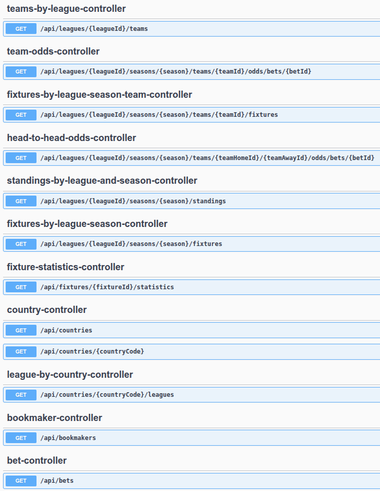

**Endpoint example (path and parameters):**

**Response example (contract):**

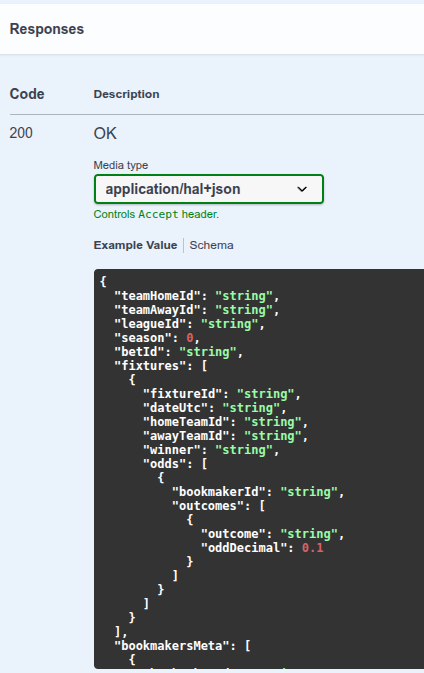

**Schema example (typing and structure):**

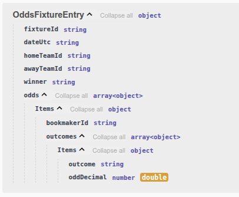

---

### Architecture (simple view)

The backend is organized as a **multi-module Maven project**, with clearly separated responsibilities to facilitate system evolution:

- **api-service:** exposes a REST API for querying consolidated domain data.
- **batch-service:** runs batch processes responsible for synchronizing and updating data from the external provider.
- **common:** contains the domain model and shared logic, reusable across different use cases.
- **infrastructure:** holds technical implementations such as persistence, external provider integration adapters, and configuration.

This organization allows responsibilities to be isolated, coupling to be reduced, and the system to evolve incrementally.

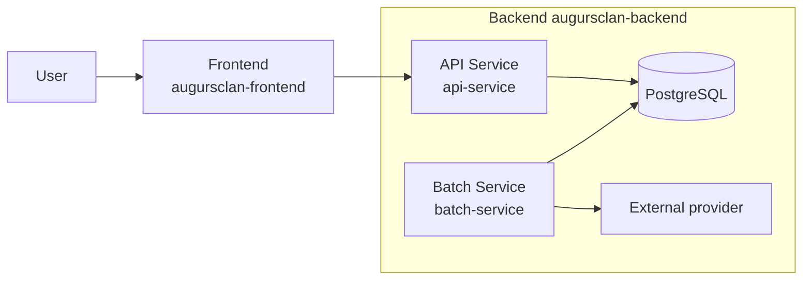

---

### Relational data model (simplified view)

Representation of the core relational data model, focused on domain entities and their key relationships.

---

### Main flow (very brief)

1. A batch process synchronizes sports data from an external provider.
2. The data is normalized and persisted in the relational database.
3. The API exposes consolidated information for consumption by the frontend.

#### Batch flow (visual)

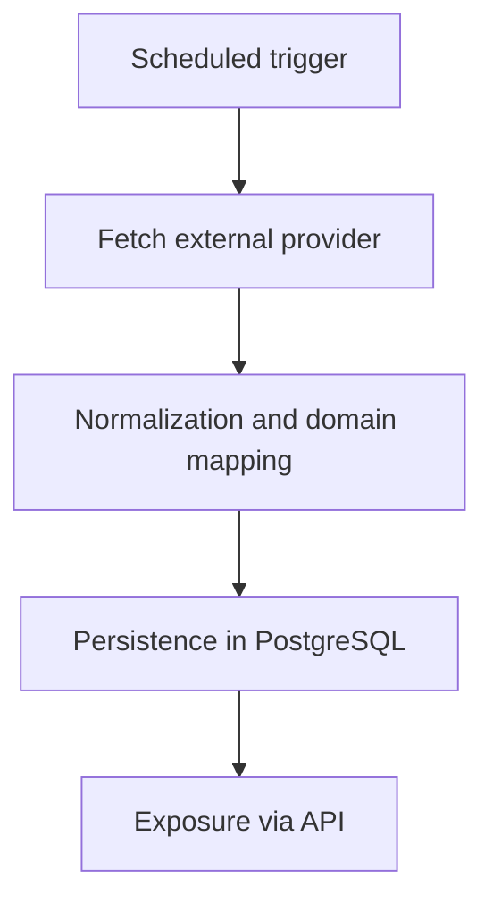

---

### Design decisions

- **API vs Batch separation**  
  Read operations (API) and ingestion/synchronization processes (batch) live in separate modules (`api-service` and `batch-service`). This reflects a clear separation of responsibilities at the project structure level, allowing joint or independent deployment depending on evolution needs.
  
- **Shared domain and logic in `common`**  
  The `common` module concentrates shared elements (domain model and application logic, along with contracts and abstractions), promoting reuse and consistency.

- **Encapsulated integrations**  
  External integrations are implemented as outbound adapters (e.g., a REST adapter for API-Football implementing a domain port).

- **DDD / ports-and-adapters inspiration**  
  The separation into domain, application, and adapters, together with the use of ports, aligns with an approach inspired by DDD and hexagonal architecture, without claiming a formal or orthodox implementation. This approach places the domain at the center of the system, with use cases around it, ensuring dependencies point inward and infrastructure remains decoupled—facilitating system evolution without unnecessary coupling.

---

### Current state / Short roadmap

#### Current state
- Operational backend with API and batch synchronization processes.
- Functional integration with an external sports data provider.
- Relational persistence and evolving domain model.
- Stable technical foundation to continue iterating at the product level.

#### Short roadmap
- Progressive extension of supported data and markets.
- Consolidation of the domain model and its rules.
- Closing the batch observability loop.
- API evolution oriented toward new read and analysis use cases.

---

### Stack

- **Backend:** Java, Spring Boot, Spring Batch  
- **Architecture:** multi-module Maven project, with clear separation of domain, application, and infrastructure, following principles inspired by DDD and hexagonal architecture.
- **API:** REST API for data exposure and read use cases, documented with OpenAPI / Swagger.
- **Persistence:** PostgreSQL (local via Docker Compose), JPA / Hibernate.
- **Integrations:** consumption of external provider REST APIs via adapters.
- **Local infra:** Docker Compose.
- **Build:** Maven.

---

### Backend structure (modular, DDD & hexagonal-inspired)

The backend is organized as a **multi-module Maven project inspired by Domain-Driven Design (DDD) and hexagonal (ports-and-adapters) architecture**, with a clear separation of responsibilities at system level.  
These principles guide the overall design of the backend, while being applied pragmatically to keep the system evolvable and maintainable.

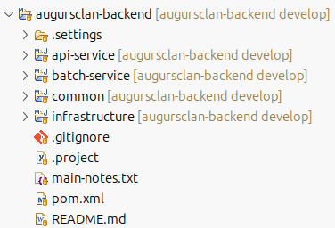

---

#### Core backend modules

- **api-service**  
  REST entry point exposing read-oriented use cases.  
  Focused on HTTP and API concerns, delegating all business logic to domain and application layers.

- **batch-service**  
  Ingestion and synchronization layer for external sports data.  
  Isolated from the API to clearly separate read use cases from data acquisition and maintenance workflows.

- **common**  
  Shared domain core and application logic reused across backend modules.  
  Contains domain entities, value objects, and shared rules, intentionally independent of infrastructure and frameworks.

- **infrastructure**  
  Technical implementations and adapters (database persistence, external REST clients, configuration).  
  Depends on the domain, never the other way around, enforcing inward dependency direction.

- **pre-analysis-service**  
  Independent module focused on pre-analysis and signal preparation use cases.  
  It provides a clear example of how domain logic, application workflows, and technical concerns are kept separated within the overall architectural approach.

---

#### Focus example: `pre-analysis-service` (internal structure)

Internally, `pre-analysis-service` is structured to clearly separate **business rules, application workflows, and technical concerns**:

- **preanalysis-domain**  
  Pure domain model and business rules for pre-analysis.  
  Framework-agnostic, stable, and focused exclusively on expressing the problem space.

- **preanalysis-application**  
  Application use cases and orchestration logic.  
  Coordinates domain behavior and defines ports (interfaces) for required external interactions.

- **preanalysis-adapters**  
  Concrete implementations of outbound ports (persistence, external services, integrations).  
  Fully replaceable, keeping technical details isolated from the core logic.

- **preanalysis-container**  
  Composition root and runtime wiring.  
  Assembles domain, application, and adapters using the chosen framework without leaking it into the core.

---

## Frontend

Web application focused on exploring and comparing sports data, conceived as an analytical layer on top of the backend API.

### Comparator overview

Interactive comparison of two teams, enabling analysis of performance, recent dynamics, and advanced metrics from multiple perspectives.

---

### Goal distribution and dynamics

Analysis of cumulative frequency and recent goal behavior, differentiating home / away context and configurable time windows.

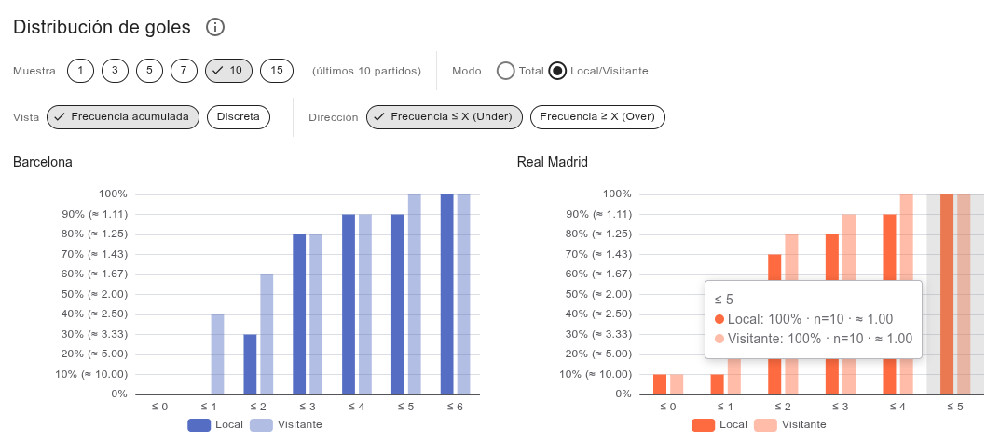

---

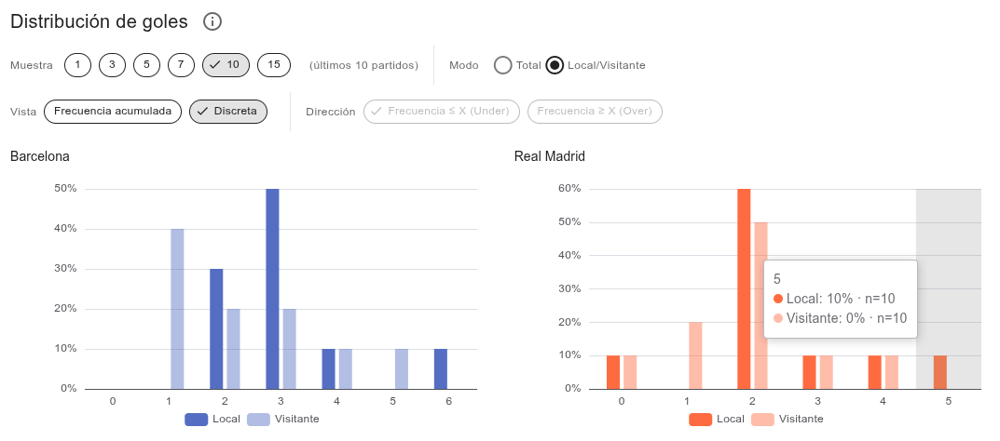

---

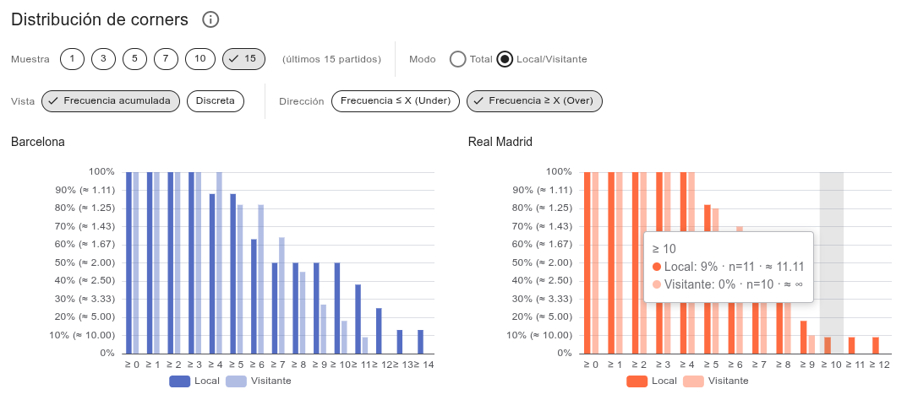

---

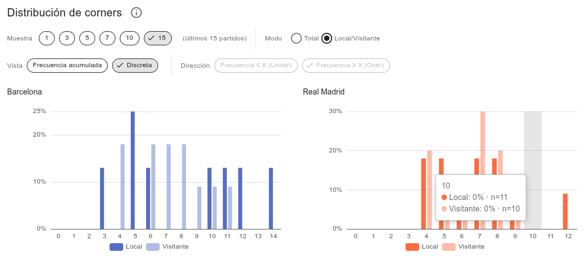

---

### Market vs reality — Win expectation

Comparison between market-implied probability and observed real probability, including the deviation (Δp) as a tension metric.

---

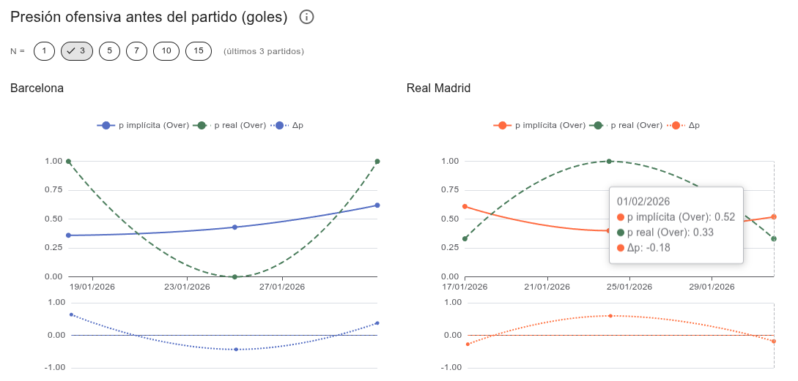

---

---

### Offensive statistics

Temporal evolution of key attacking metrics, with configurable smoothing and home / away separation.

---

---

---

### Game control and offensive pressure

Indicators of dominance and chance creation: ball possession and shots inside the box.

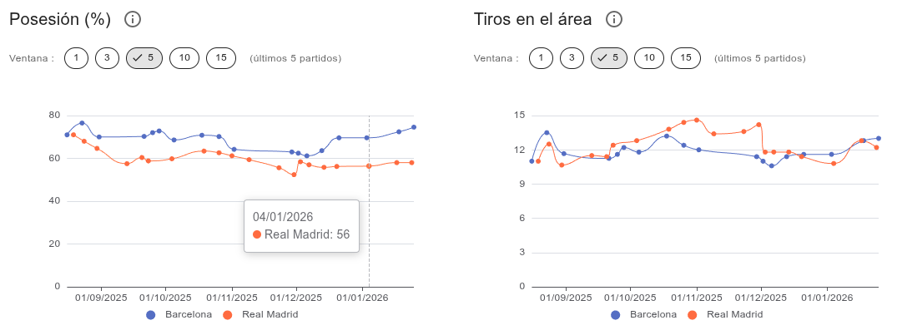

---

### Tactical play and defensive performance

Metrics related to game structure and defensive response: offsides and goalkeeper saves.

---

### Competitive evolution

Longitudinal tracking of competitive performance: accumulated points and goal balance.

---

### League context and overall performance

League standings and comparative summary of aggregated performance.

---

### Design decisions

- Clear separation between data access, analytical transformation, and UI components to maintain clarity and testability.
- Execution of part of the analytical logic on the frontend (market-implied vs real probabilities, smoothing, time series) to favor exploration and visual validation without overloading the backend.
- Visualizations designed for readability and context, not information density.
- Visualizations and metrics are conceived as tools to support interpretation and human judgment, prioritizing context, comparison, and narrative over automation or opaque decision-making.

### Current state

- Functional and stable frontend connected to the backend API.
- Core comparison sections already operational, evolving in parallel with the data model.
- Metrics and visualizations added incrementally.

**Main stack:** Nuxt, Vue, TypeScript, Vuetify, ECharts, i18n.

---

### Frontend structure (analysis- and visualization-oriented)

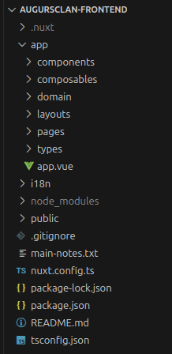

- **components:** reusable UI components and comparator sections (charts, visual layouts, widgets).
- **composables:** orchestration and state logic (fetching, filters, params, UI synchronization, Vue/Nuxt helpers).
- **domain:** analytical transformation and business rules (time series, smoothing, metrics, probabilities).
- **types:** shared TypeScript contracts and DTOs (API types, chart models, domain structures).

---

## Related repositories

- **Backend:** private repository (API and batch processes).
- **Frontend:** private repository (data exploration and visualization application).

> The backend and frontend are maintained in private repositories; **the source code and the running application** can be demonstrated live during technical interview processes.
