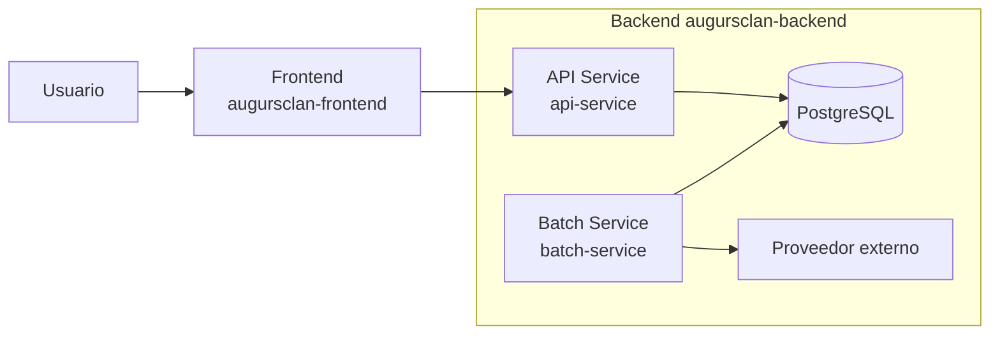
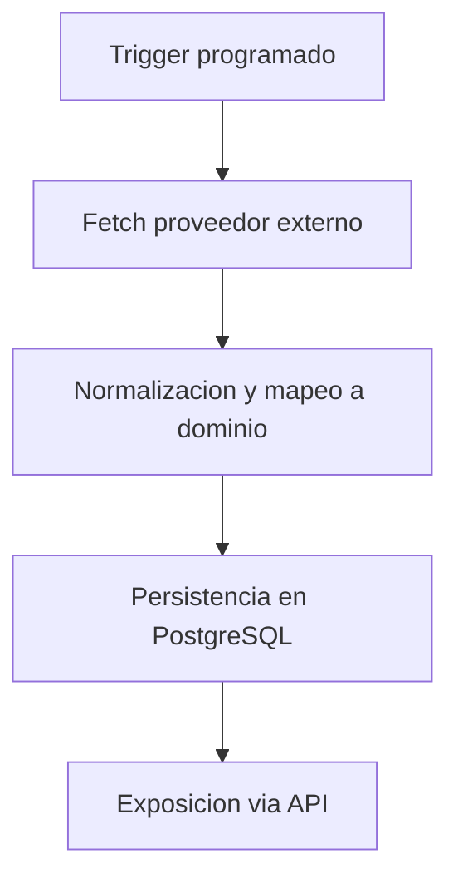
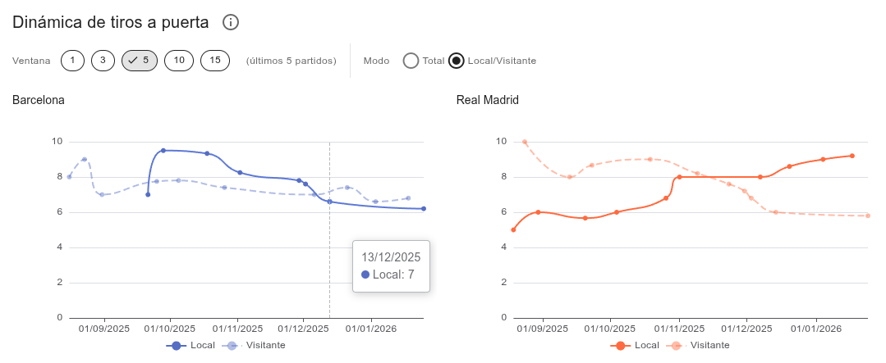

# AugursClan — Project Overview

Plataforma en construcción para análisis y visualización de datos deportivos.  
Este repositorio ofrece una **vista pública** de las decisiones de producto y arquitectura de AugursClan (MVP en progreso).

> ℹ️ Este repositorio es una **vista pública del proyecto AugursClan**.  
> El backend y el frontend se mantienen en repositorios privados; **el código y la aplicación en ejecución** pueden mostrarse en directo durante procesos de selección técnica.

---

## Componentes del sistema

- [Backend](#backend)
- [Frontend](#frontend)

---

## Backend

### Resumen rápido

- **Qué es:** backend con API REST y procesos batch de sincronización de datos deportivos.
- **Estado:** producto en construcción (MVP en progreso).
- **Para quién:** recruiters y equipos técnicos que evalúan criterio técnico y capacidad de ejecución.
- **Qué demuestra:** arquitectura modular por capas, integraciones encapsuladas y decisiones de diseño orientadas a mantenibilidad.

---

### Qué incluye (alto nivel)

- **Backend API:** endpoints para consultar y exponer datos consolidados del dominio.
- **Batch de sincronización:** procesos batch programados que sincronizan datos desde un proveedor externo.
- **Integración externa:** adaptadores para obtener datos deportivos desde un servicio de terceros.
- **Base de datos relacional:** persistencia estructurada de las entidades principales del dominio.
- **Arquitectura modular por capas:** dominio desacoplado de infraestructura mediante adaptadores (DB/proveedores).

---

### API Contract (Swagger / OpenAPI)

La API se documenta mediante Swagger (OpenAPI), lo que permite explorar recursos, parámetros y esquemas de respuesta de forma inmediata.

**Listado de endpoints (visión global):**

**Ejemplo de endpoint (parámetros y ruta):**

**Ejemplo de respuesta (contrato):**

**Ejemplo de esquema (tipado y estructura):**

---

### Arquitectura (visión simple)

El backend está organizado como un proyecto **multi-módulo Maven**, con responsabilidades claramente separadas para facilitar la evolución del sistema:

- **api-service:** expone una API REST para la consulta de datos consolidados del dominio.
- **batch-service:** ejecuta procesos batch encargados de sincronizar y actualizar datos desde proveedores externos.
- **common:** concentra el modelo de dominio y la lógica compartida, reutilizable por distintos casos de uso.
- **infrastructure:** contiene implementaciones técnicas como persistencia, clientes externos y configuración.

Esta organización permite aislar responsabilidades, reducir acoplamientos y evolucionar el sistema de forma incremental.

---

### Modelo de datos relacional (vista simplificada)

Representación del modelo relacional principal, centrada en entidades de dominio y sus relaciones clave.

---

### Flujo principal (muy breve)

1. Un proceso batch sincroniza datos deportivos desde un proveedor externo.
2. Los datos se normalizan y se persisten en la base de datos relacional.
3. La API expone información consolidada para su consumo por el frontend.

#### Flujo batch (visual)

---

### Decisiones de diseño

- **Separación API vs Batch**  
  La lectura (API) y la ingesta/sincronización (batch) viven en módulos distintos (`api-service` y `batch-service`). Esto refleja separación a nivel de estructura del proyecto (no necesariamente despliegue independiente).

- **Dominio y lógica compartida en `common`**  
  El módulo `common` concentra piezas compartidas (dominio/aplicación/acceso a datos en submódulos), favoreciendo reutilización y consistencia.

- **Integraciones encapsuladas**  
  Las integraciones externas se implementan como adaptadores de salida (p. ej. un adaptador REST para API-Football que implementa un puerto del dominio).

- **Inspiración DDD / puertos-adaptadores**  
  La separación por dominio, aplicación y adaptadores, junto al uso de puertos, es coherente con un enfoque inspirado en DDD y arquitectura hexagonal, sin afirmar una implementación formal/ortodoxa.

---

### Estado actual / Roadmap breve

#### Estado actual
- Backend operativo con API y procesos batch de sincronización.
- Integración funcional con proveedor externo de datos deportivos.
- Persistencia relacional y modelo de dominio en evolución.
- Base técnica estable para seguir iterando a nivel de producto.

#### Roadmap breve
- Ampliar cobertura de datos y mercados soportados.
- Refinar lógica de dominio y validaciones.
- Mejorar observabilidad del batch (logs y métricas).
- Exponer nuevos endpoints orientados a visualización y análisis.

---

### Stack

- **Backend:** Java, Spring Boot, Spring Batch  
- **Arquitectura:** proyecto multi-módulo Maven, organización por capas  
- **Persistencia:** PostgreSQL (local con Docker Compose), JPA/Hibernate  
- **Integraciones:** APIs REST externas  
- **Infra local:** Docker Compose  
- **Build:** Maven

---

## Frontend

Aplicación web orientada a la exploración y comparación de datos deportivos, concebida como una capa de análisis sobre la API del backend.

### Vista general del comparador

Comparador interactivo de dos equipos que permite analizar rendimiento, dinámica reciente y métricas avanzadas desde múltiples perspectivas.

---

### Distribución y dinámica de goles

Análisis de frecuencia acumulada y comportamiento reciente de goles, diferenciando contexto local / visitante y ventanas temporales configurables.

---

### Mercado vs realidad — Expectativa de victoria

Comparativa entre probabilidad implícita del mercado y probabilidad real observada, incluyendo la desviación (Δp) como métrica de tensión.

---

### Estadísticos ofensivos

Evolución temporal de métricas clave de ataque, con suavizados configurables y separación por local / visitante.

---

### Control del juego y presión ofensiva

Indicadores de dominio y generación de peligro: posesión de balón y tiros dentro del área.

---

### Juego táctico y rendimiento defensivo

Métricas relacionadas con estructura de juego y respuesta defensiva: fueras de juego y paradas del portero.

---

### Evolución competitiva

Seguimiento longitudinal del rendimiento en competición: puntos acumulados y balance de goles.

---

### Contexto de liga y rendimiento global

Situación en la clasificación y resumen comparativo de rendimiento agregado.

---

### Decisiones de diseño

- Separación entre acceso a datos, transformación analítica y componentes de UI para mantener claridad y testabilidad.
- Ejecución de parte de la lógica analítica en el frontend (probabilidades implícitas vs reales, suavizados, series temporales) para favorecer exploración y validación visual sin sobrecargar el backend.
- Visualizaciones orientadas a legibilidad y contexto, no a densidad de información.

### Estado actual

- Frontend funcional conectado a la API del backend.
- Secciones principales de comparación en evolución junto al modelo de datos.
- Nuevas métricas y visualizaciones añadidas de forma incremental.

**Stack principal:** Nuxt, Vue, TypeScript, Vuetify, ECharts, i18n.

---

## Repos relacionados

- **Backend (Spring Boot, Spring Batch):** repositorio privado.
- **Frontend (Nuxt / Vue):** aplicación de visualización y exploración de datos, repositorio privado.

> El backend y el frontend se mantienen en repositorios privados; **el código y la aplicación en ejecución** pueden mostrarse en directo durante procesos de selección técnica.

