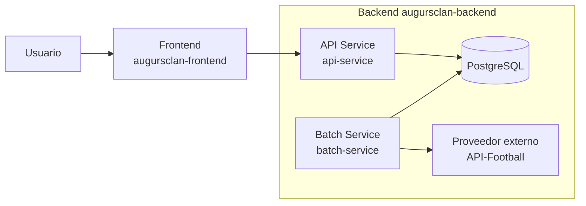
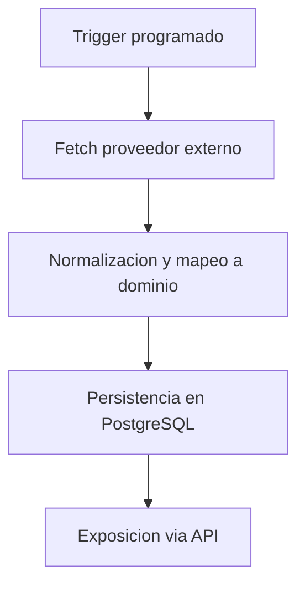

# AugursClan Backend

Backend del producto **AugursClan**: una plataforma en construcción para análisis y visualización de datos deportivos.  
Este repositorio muestra decisiones de producto y de arquitectura en un sistema real (MVP en progreso).

---

## 📌 Resumen rápido

- **Qué es:** backend con API REST y procesos batch de sincronización de datos deportivos.
- **Estado:** producto en construcción (MVP en progreso).
- **Para quién:** recruiters y equipos técnicos que evalúan criterio técnico y capacidad de ejecución.
- **Qué demuestra:** arquitectura modular por capas, integraciones encapsuladas y decisiones de diseño orientadas a mantenibilidad.

---

## 🧩 Qué incluye (alto nivel)

- **Backend API:** endpoints para consultar y exponer datos consolidados del dominio.
- **Batch de sincronización:** procesos batch programados que sincronizan datos desde un proveedor externo.
- **Integración externa (API-Football):** adaptadores para obtener datos deportivos desde un servicio de terceros.
- **Base de datos relacional:** persistencia estructurada de las entidades principales del dominio.
- **Arquitectura modular por capas:** dominio desacoplado de infraestructura mediante adaptadores (DB/proveedores).

---

## 🏗️ Arquitectura (visión simple)

El backend está organizado como un proyecto **multi-módulo Maven**, con responsabilidades claramente separadas para facilitar la evolución del sistema:

- **api-service:** expone una API REST para la consulta de datos consolidados del dominio.
- **batch-service:** ejecuta procesos batch encargados de sincronizar y actualizar datos desde proveedores externos.
- **common:** concentra el modelo de dominio y la lógica compartida, reutilizable por distintos casos de uso.
- **infrastructure:** contiene implementaciones técnicas como persistencia, clientes externos y configuración.

Esta organización permite aislar responsabilidades, reducir acoplamientos y evolucionar el sistema de forma incremental.

---

## 🔄 Flujo principal (muy breve)

1. Un proceso batch sincroniza datos deportivos desde un proveedor externo.
2. Los datos se normalizan y se persisten en la base de datos relacional.
3. La API expone información consolidada para su consumo por el frontend.

### 🔁 Flujo batch (visual)

---

## ✅ Decisiones de diseño

- **Separación API vs Batch**  
  La lectura (API) y la ingesta/sincronización (batch) viven en módulos distintos (`api-service` y `batch-service`). Esto refleja separación a nivel de estructura del proyecto (no necesariamente despliegue independiente).

- **Dominio y lógica compartida en `common`**  
  El módulo `common` concentra piezas compartidas (dominio/aplicación/acceso a datos en submódulos), favoreciendo reutilización y consistencia.

- **Integraciones encapsuladas**  
  Las integraciones externas se implementan como adaptadores de salida (p. ej. un adaptador REST para API-Football que implementa un puerto del dominio).

- **Inspiración DDD / puertos-adaptadores**  
  La separación por dominio, aplicación y adaptadores, junto al uso de puertos, es coherente con un enfoque inspirado en DDD y arquitectura hexagonal, sin afirmar una implementación formal/ortodoxa.

---

## 🧪 Estado actual / Roadmap breve

### Estado actual
- Backend operativo con API y procesos batch de sincronización.
- Integración funcional con proveedor externo de datos deportivos.
- Persistencia relacional y modelo de dominio en evolución.
- Base técnica estable para seguir iterando a nivel de producto.

### Roadmap breve
- Ampliar cobertura de datos y mercados soportados.
- Refinar lógica de dominio y validaciones.
- Mejorar observabilidad del batch (logs y métricas).
- Exponer nuevos endpoints orientados a visualización y análisis.

---

## 🧰 Stack

- **Backend:** Java, Spring Boot, Spring Batch  
- **Arquitectura:** proyecto multi-módulo Maven, organización por capas  
- **Persistencia:** PostgreSQL (local con Docker Compose), JPA/Hibernate  
- **Integraciones:** APIs REST externas (API-Football)  
- **Infra local:** Docker Compose  
- **Build:** Maven
  

---

## 🚀 Quickstart 

> Nota: el proyecto está en evolución. Esta sección se completará cuando los flujos de ejecución estén estabilizados.

- Base de datos: `docker compose up -d`
- Build: `mvn clean install`
- Ejecución: *(pendiente de concretar)*

---

## 📷 Demo

*(Pendiente. Se añadirá cuando el frontend esté listo y haya una demo navegable.)*

---

## 🔗 Repos relacionados

- **Frontend (Nuxt/Vue):** *(pendiente de publicación)*

  